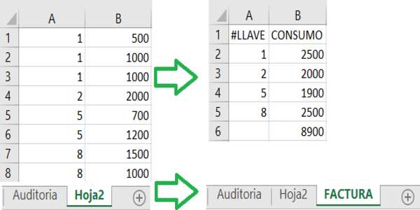

Esta aplicacion fue progrmada en python3.10.
Adicionalmente se deben instalar las siguientes librerias usando PIP: openpyxl, tkinter y numpy. 

Funcionalidad:

 

Toma la segunda hoja de un archivo en formato libro excel (.xlsx), en donde deben estar los registros de las ventas en la forma |LLAVE|VALOR|, y hace la sumatoria de las ventas por llave o cliente, poniento un tope maximo a este total consumido por llave llamado "Asignacion". 

Pretende ayudar a procesar los datos que arroja la lectura de los registros de una maquina de snacks, la cual permite el uso de tarjetas electronicas o llaves para comprar productos. "Asignacion" es el valor inicial de la tarjeta que se recarga a inicio de mes por la empresa, y en el transcurso del mismo se pueden dar mas recargas a las llaves con dinero del cliente, de modo que el maximo a cobrar por cliente a final de mes sera siempre el valor de la Asignacion.  
